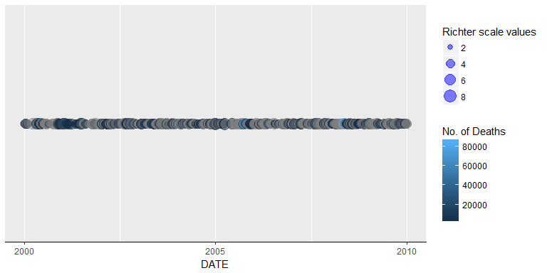
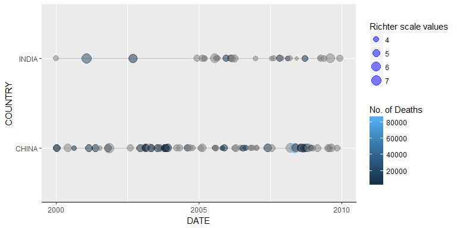
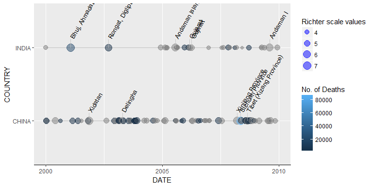

<!-- README.md is generated from README.Rmd. Please edit that file -->
NOAA package
============

This package contains following functions.

eq\_clean\_data()
-----------------

It adds the column DATE and changes the type of LONGITUDE and LATITUDE columns. It takes a dataframe with NOAA earthquake data as input and returns a dataframe with DATE column and it also changes the type of LONGITUDE and LATITUDE column to numeric.

eq\_location\_clean()
---------------------

It removes the country name from LOCATION\_NAME column and also makes it Title case. This function makes an internal call to **eq\_clean\_data()** to ease the process. We could just call **eq\_location\_clean()** instead of calling both functions.

get\_timeline()
---------------

The wrapper function for geom\_timeline. Renders the timeline based on countries parameter. It takes the NOAA dataframe, a vector of countries and minimum and maximum values of timeline as input. It makes internal call to **geom\_timeline()** and renders the output based on the value we give at "countries" attribute. To render a timeline of earthquakes irrespective of countries we need to pass "\*" in the countries parameter.

``` r
NOAA::get_timeline(noaa.df, "*","2000-01-01","2010-01-01")
```



``` r
NOAA::get_timeline(noaa.df, c("CHINA", "INDIA"),"2000-01-01","2010-01-01")
```

 For the output of get\_timeline we could add the geom "geom\_timeline\_label()" which will add label to "n" number of earthquakes.

``` r
NOAA::get_timeline(noaa.df, c("CHINA", "INDIA"),"2000-01-01","2010-01-01") +
NOAA::geom_timeline_label(ggplot2::aes(x=DATE, location=LOCATION_NAME,xmin=xmin,xmax=xmax,size=EQ_PRIMARY,y=COUNTRY), n_max = 5)
```

 \#\# eq\_map() It creates an interactive map with popup based on **annot\_col** attribute. It takes the NOAA dataframe and annot\_col value as input. The value of annot\_col can be any column in the dataframe.

eq\_create\_label()
-------------------

It creates a label with Location, Magnitude and Total Deaths.

This package contains the following geoms.

geom\_timeline()
----------------

A geom to render the timeline of earthquake with magnitude and total deaths.

geom\_timeline\_label()
-----------------------

A geom to add label to timeline of earthquake created by geom\_timeline.
